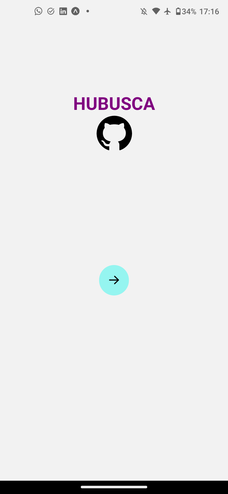

# HUBUSCA




> O Hubusca é um aplicavo que permite que você busque um usuário do GitHub e veja informações sobre ele e seus repositórios. Basta inserir o username dele e para mais informações é so clicar na foto do perfil.

## 💻 Pré-requisitos

Antes de começar, verifique se você atendeu aos seguintes requisitos:
* Você instalou a versão 20.10.0 do `Node JS`?

## 🚀 Instalando o HUBUSCA

Para instalar o HUBUSCA, siga esta etapa:

Linux:
```
1. npm install
2. npx expo install
```

## ☕ Usando o HUBUSCA

Para usar HUBUSCA, siga esta etapa:

```
1. configurar a variável de ambiente TOKEN_API (da API do GitHub)
2. npx expo start ou npm start
3. instalar o App Expo GO no smartphone
4. Ler pelo Expo Go o QR gerado pelo start da aplicação

```
[⬆ Voltar ao topo](#hubusca)<br>